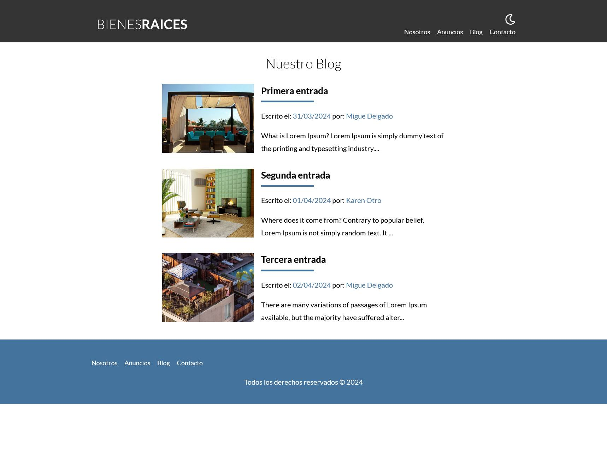

# Bienes Raíces (Versión MVC)

En la última fase de nuestro proyecto, vamos a realizar la migración desde el final de la versión de Bíenes Raíces (POO) a esta nueva versión que hace uso del paradigma MVC. Dicho paradigma nos permite una mejor separación entre la lógica y las vistas, haciendo el código más mantenible.

## Migración desde POO

Antes de empezar con este último proyecto, vamos a proceder a migrar lo que teniamos al final del proyecto anterior. Para ello deberemos realizar los siguientes pasos:

1) Copiamos la carpeta classes del proyecto anterior y la renombramos como models.

2) Copiamos los ficheros ```composer.json```, ```composer.lock```, ```package.json```, ```package-loc.json``` y ```gulpfile.js```

3) Ejecutamos los comandos

> composer install

y

> npm i

4) Copiamos la carpeta  includes

5) Creamos las carpetas controllers, views y public

6) Editamos el fichero  ```composer.json``` para añadir lo siguiente (borrando lo existente)

```
"psr-4": {
            "Model\\": "./models",
            "MVC\\": "./",
            "Controllers\\": "./controllers"
        }
```

7) Editamos ```gulpfile.js``` para añadir ./public/ en todas las rutas que encontremos

8) Ejectuamos ```npm run dev ``` para generar los css y js

9) Por último, en public, creamos un fichero ```index.php``` en blanco. 

## Mejoras y añadidos personales hechos al proyecto

Una vez acabado todos los videos, para afianzar los conceptos y practicar algo más, he llevado a cabo las sigueitnes modificaciones:

- Se ha creado un fichero .env  con las variables de entorno necesarias para acceder a la base de datos o al correo.
- Al modelo de vendedores se le ha añadido los campos email y foto.
- Se ha creado el modelo blog, así como el controlador y vistas necesarios para su gestión.
- En la página principal ahroa se carga de forma dinamica las entradas del blog.
- Se ha modificado los colores.

## Demo

En la dirección https://bienesraices.miguelandelgado.com/ se encuentra desplegada la parte pública de la web. No esta disponble la parte de administración para el público.

## Imagenes

Se muestra una galeria de imagenes para ver el resultado final.

<p align="center">
  <a href="img/main.jpg" target="_blank">
    
  </a>
  <a href="img/dark.jpg" target="_blank">
    
  </a><a href="img/light.jpg" target="_blank">
    
  </a><a href="img/admin.jpg" target="_blank">
    
  </a><a href="img/blog.jpg" target="_blank">
    
  </a><a href="img/entrada.jpg" target="_blank">
    
  </a>
</p>


